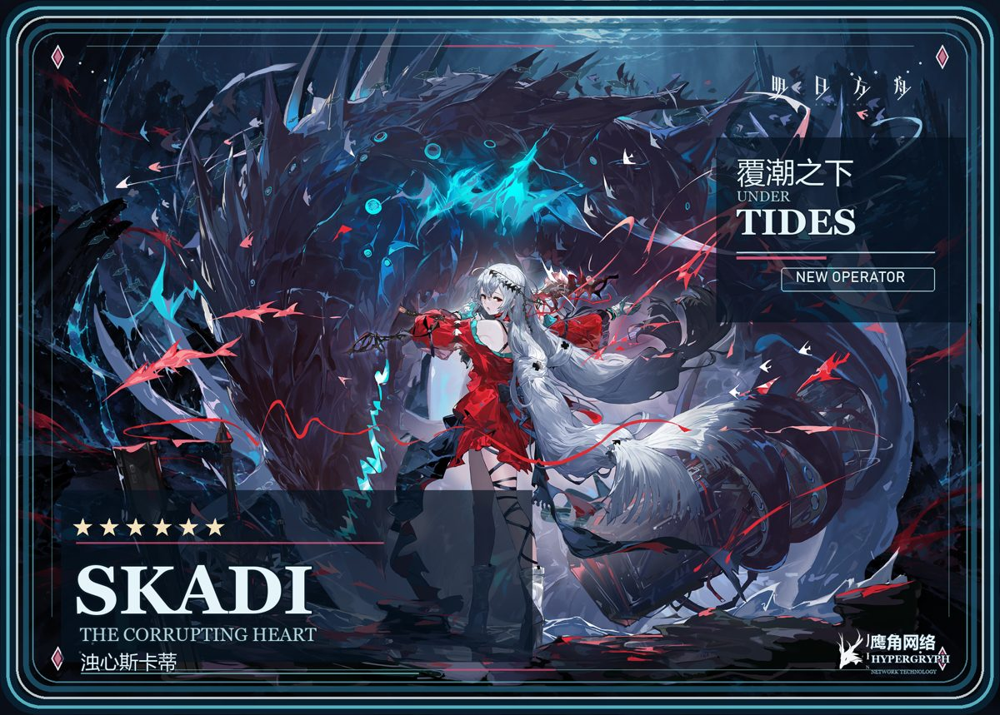
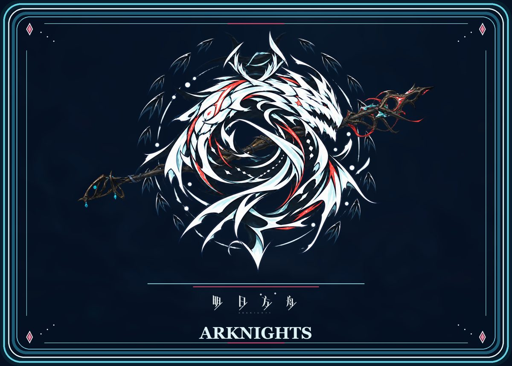

# Skadi the Corrupting Heart — Interactive Holo Card

> **Personal project · Non-work · Unofficial fan creation**

An interactive holographic card inspired by Skadi the Corrupting Heart from *Arknights*. Drag or touch to rotate, tap to flip, and adjust the depth and contour glow in the browser.

**[View the card online](https://terry3095320679.github.io/personal-skadi-holo-card/)**

| Front | Back |
| --- | --- |
|  |  |

## About this project

- This is a **personal, non-work fan project**, not an official *Arknights* or Hypergryph product.
- The game, character, names, and related artwork belong to their respective rights holders. This page is for noncommercial display.
- `index.html` is a self-contained interactive page. This repository contains no account credentials or local development files.
- The interactive effect was made with the local workflow from [LerSent001/holo-card](https://github.com/LerSent001/holo-card). See [THIRD_PARTY_NOTICES.md](THIRD_PARTY_NOTICES.md) for third-party notices.

## Viewing

Open the link above on a phone or desktop browser. On a phone, drag to rotate and tap to flip. Motion sensor control depends on browser support and permission.
